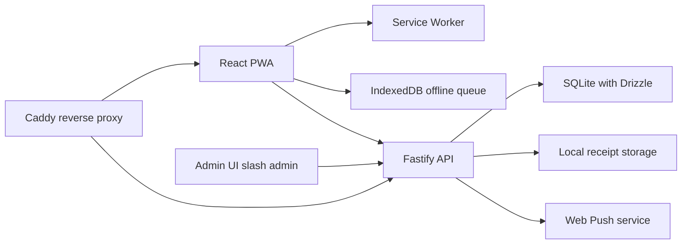

# Ortaq Maliyyə System Plan

## 1. Product goal

Build a mobile-first shared finance system for two users with a separate admin experience under `/admin`, while keeping one React codebase for the user app and admin UI.

The MVP must deliver:

- fast daily income, expense, and transfer entry
- transparent per-user and total balance visibility
- immutable audit visibility for create, update, delete, sync, login, and admin actions
- reliable offline-first transaction capture with later sync
- PWA installability and push notifications
- low-ops deployment on one VPS

## 2. Locked implementation assumptions

- Auth: HTTP-only cookie auth with server-managed sessions
- Frontend: React + Vite + TypeScript + PWA
- Admin: same React app, route namespace under `/admin`
- Backend: Fastify + TypeScript
- Database: SQLite + Drizzle + better-sqlite3
- Offline queue: IndexedDB
- Push: Web Push via Service Worker
- Receipt uploads: local disk storage on the VPS
- Deployment: Docker Compose + Caddy on a single VPS

## 3. Recommended repository shape

Use a simple two-app structure instead of a heavy monorepo.

```text
/
  web/                  React + Vite app for user and admin routes
  api/                  Fastify API server
  shared/               shared schema types and constants
  docker/               container and infra configs
  plans/                product and execution plans
```

This keeps the codebase understandable while still allowing shared types between the frontend and backend.

## 4. High-level architecture



## 5. Core architecture decisions

### 5.1 Frontend application model

One Vite app should power both experiences:

- user routes for mobile-first daily usage
- admin routes under `/admin`
- shared auth session state
- shared API client and schema validation
- shared design tokens with two visual densities

Recommended client libraries:

- `react-router-dom` for route segmentation
- `@tanstack/react-query` for server state and cache invalidation
- `react-hook-form` + `zod` for forms and validation
- `idb` for IndexedDB queue persistence
- `recharts` for dashboard and stats charts
- `tailwindcss` for rapid Apple-style visual polish with custom tokens

### 5.2 Backend application model

The Fastify API should be split into clear modules:

- auth
- users
- balances
- transactions
- transfers
- categories
- stats
- notification preferences
- push subscriptions
- sync
- audit
- admin
- uploads

Use schema-first validation for every request and response, with shared validation shapes whenever possible.

### 5.3 Data ownership rule

Canonical financial state lives on the server only.

The browser stores:

- cached read models for responsiveness
- pending offline mutations in IndexedDB
- push subscription metadata until successfully synced

The browser must never be treated as the source of truth for balances.

## 6. Business rules that must be preserved in code

These rules are the heart of the system and should drive service-layer design:

1. Cash and card are not separate balance domains.
2. Income increases the balance of the acting user.
3. Expense decreases the balance of the acting user.
4. Transfer decreases sender balance and increases receiver balance in the same database transaction.
5. A normal user may edit or delete only their own transactions.
6. Update and delete operations must trigger balance correction logic.
7. Every create, update, delete, sync, login, and admin action must create an audit record.
8. Categories created by users are shared across both users.
9. Offline sync must be idempotent using `client_operation_id`.

## 7. Recommended data model

Base tables from the PRD should be implemented, with a few additions for auth and notification fallback.

### 7.1 Required tables

- `users`
- `sessions`
- `balances`
- `transactions`
- `transaction_revisions`
- `categories`
- `notification_preferences`
- `push_subscriptions`
- `sync_queue_meta`
- `audit_logs`
- `notification_center`

### 7.2 Key additions beyond the PRD

#### `sessions`

Purpose:

- support secure HTTP-only cookie sessions
- allow logout, forced logout, and session invalidation

Suggested columns:

- `id`
- `user_id`
- `token_hash`
- `expires_at`
- `created_at`
- `last_seen_at`
- `ip_address`
- `user_agent`

#### `notification_center`

Purpose:

- provide in-app notification fallback when push permission is denied or push delivery fails

Suggested columns:

- `id`
- `user_id`
- `type`
- `title`
- `body`
- `is_read`
- `created_at`

### 7.3 Database implementation notes

- enable SQLite WAL mode on startup
- keep write transactions short and explicit
- perform balance mutation and audit insert in the same transaction
- store receipts outside the database and keep only normalized file paths in the database
- make deletes soft or revision-based, but preserve the ability to reconstruct history

## 8. Backend API plan

### 8.1 Auth endpoints

- `POST /auth/login`
- `POST /auth/logout`
- `GET /auth/me`
- `POST /auth/change-password`

### 8.2 User app endpoints

- `GET /dashboard/summary`
- `GET /dashboard/recent`
- `GET /transactions`
- `POST /transactions`
- `PATCH /transactions/:id`
- `DELETE /transactions/:id`
- `POST /transfers`
- `GET /categories`
- `POST /categories`
- `GET /stats/overview`
- `GET /stats/by-category`
- `GET /stats/by-user`
- `GET /notification-preferences`
- `PUT /notification-preferences`
- `POST /push/subscribe`
- `POST /sync/batch`

### 8.3 Admin endpoints

- `GET /admin/summary`
- `GET /admin/users`
- `POST /admin/users`
- `PATCH /admin/users/:id/status`
- `POST /admin/users/:id/reset-password`
- `GET /admin/categories`
- `PATCH /admin/categories/:id`
- `GET /admin/transactions`
- `GET /admin/audit-logs`
- `GET /admin/sync-health`
- `GET /admin/settings`
- `PUT /admin/settings`

### 8.4 Service-layer rule

Do not place balance logic directly inside route handlers. Route handlers should validate input and delegate to domain services such as:

- `auth.service`
- `transaction.service`
- `balance.service`
- `sync.service`
- `audit.service`
- `notification.service`

## 9. Frontend information architecture

### 9.1 User routes

- `/login`
- `/`
- `/transactions`
- `/transactions/new/income`
- `/transactions/new/expense`
- `/transactions/new/transfer`
- `/transactions/:id`
- `/stats`
- `/notifications`
- `/settings/notifications`
- `/profile`

### 9.2 Admin routes

- `/admin`
- `/admin/users`
- `/admin/categories`
- `/admin/transactions`
- `/admin/audit`
- `/admin/settings`

### 9.3 Recommended UI shell

User app:

- top summary header
- high-emphasis balance cards
- bottom tab bar for one-hand usage
- floating add action with quick actions for income, expense, and transfer

Admin app:

- left rail or compact top navigation depending on screen width
- denser tables and filters
- calmer neutral background with less visual motion

## 10. Apple-style design direction

The design should feel premium, quiet, and highly legible rather than decorative.

### 10.1 Visual principles

- generous white space
- subtle layered surfaces
- soft shadows and thin separators
- large numeric typography for balances and KPI cards
- restrained accent color system
- smooth motion for sheet transitions and success feedback
- polished empty states and loading skeletons

### 10.2 Design tokens

Suggested palette direction:

- background: warm off-white and very light gray surfaces
- primary text: deep graphite
- accent: one clean blue for active state and trust
- success: soft green
- danger: muted red, used sparingly
- warning: amber for pending sync states

Suggested typography:

- system-first stack similar to San Francisco
- large bold balance numbers
- medium-weight section labels
- compact but airy table typography in admin

Suggested component treatment:

- rounded cards with 20 to 28 radius on mobile hero cards
- glass-like headers only where it helps hierarchy
- segmented controls for filters and time ranges
- bottom sheets for transaction entry and quick actions
- charts with thin strokes and low-noise grid lines

### 10.3 UX rules

- every primary task should be reachable in one or two taps from the home screen
- pending offline actions must always be visible but non-alarming
- destructive actions require a clear confirm sheet
- forms should preserve draft input during accidental navigation or temporary connectivity loss

## 11. Offline-first and sync strategy

### 11.1 Client queue model

Each offline mutation should be stored with:

- `client_operation_id`
- operation type
- payload
- created timestamp
- retry count
- local status `pending | syncing | failed | synced`

### 11.2 Sync behavior

Sync should run when:

- app launches
- connection is restored
- user manually refreshes
- user explicitly taps retry on failed items

### 11.3 Server idempotency rule

`POST /sync/batch` must check `client_operation_id` before applying business effects. If the same operation was already accepted, the server should return a safe success response without duplicating balance impact.

### 11.4 Conflict policy for MVP

Use a simple rule:

- server state is authoritative
- client retries are safe because of idempotency keys
- if an edit targets a transaction already changed on the server, return a conflict response and keep the failed item visible for manual user review

## 12. Push notification design

### 12.1 Events

- new income
- new expense
- transfer created
- transaction updated
- transaction deleted
- sync failure requiring attention

### 12.2 Delivery model

- generate VAPID keys
- subscribe from the PWA after explicit user opt-in
- store subscription endpoints in `push_subscriptions`
- fan out notifications based on `notification_preferences`
- record a matching in-app notification entry for fallback visibility

### 12.3 Service Worker responsibilities

- cache app shell for installability
- display push notifications
- focus or open the correct route on notification tap
- support update lifecycle without trapping the user on stale assets

## 13. Security and reliability plan

### 13.1 Security baseline

- use Argon2 for password hashing
- use signed HTTP-only secure cookies
- rotate session tokens on login and password reset
- apply role-based authorization to every admin route
- rate-limit login attempts
- validate upload MIME type, extension, size, and image dimensions
- prevent direct public indexing of receipt directories

### 13.2 Reliability baseline

- daily SQLite backup plus pre-deploy snapshot
- health endpoint for uptime checks
- sync error logging with admin visibility
- startup migrations and seed data for default categories
- explicit retention strategy for logs and uploaded receipts

## 14. Recommended implementation sequence

This is the execution-ready checklist for [💻 Code](code:1) mode.

### 14.1 Foundation

- [ ] Initialize root workspace structure for `web`, `api`, `shared`, `docker`, and `plans`
- [ ] Set up TypeScript configuration and shared path aliases
- [ ] Set up package scripts for dev, build, lint, test, and migrate
- [ ] Configure environment variable strategy for local and production

### 14.2 Frontend app shell and design system

- [ ] Scaffold the Vite React TypeScript app in `web`
- [ ] Add React Router with user and admin route groups
- [ ] Add Tailwind CSS and define Apple-style design tokens
- [ ] Build shared primitives for button, card, input, sheet, dialog, badge, and tabs
- [ ] Create responsive app shells for user and admin layouts

### 14.3 Authentication

- [ ] Scaffold the Fastify app in `api`
- [ ] Implement `users` and `sessions` tables with Drizzle
- [ ] Build login, logout, and current-session endpoints
- [ ] Implement session cookie issuance, validation, rotation, and logout invalidation
- [ ] Protect user routes and admin routes separately on both client and server

### 14.4 Database and domain model

- [ ] Implement Drizzle schema for users, balances, transactions, revisions, categories, preferences, subscriptions, sync metadata, audit logs, notifications, and sessions
- [ ] Configure SQLite WAL mode and startup migration flow
- [ ] Seed default users, admin, and initial category set
- [ ] Implement typed repositories or service helpers for balance-safe database access

### 14.5 Transactions and balances

- [ ] Build create income flow with balance increment and audit record
- [ ] Build create expense flow with category support, receipt path support, and balance decrement
- [ ] Build transfer flow with atomic debit and credit behavior
- [ ] Build update transaction flow with balance recalculation and revision record
- [ ] Build delete transaction flow with balance rollback and audit record
- [ ] Build transaction list, filters, detail screen, and owner-only action controls in the frontend

### 14.6 Dashboard and analytics

- [ ] Implement dashboard summary queries for total balance, per-user balance, today income, today expense, and recent activity
- [ ] Implement stats endpoints for overview, by category, and by user
- [ ] Build user dashboard cards, recent feed, and lightweight charts
- [ ] Build stats screens with date-range filters and segmented controls

### 14.7 Categories and receipt uploads

- [ ] Implement shared category listing and category creation endpoints
- [ ] Build category management UI in the user app and admin panel
- [ ] Implement image upload endpoint with validation and compression pipeline
- [ ] Store uploaded receipts on local disk with predictable folder structure and safe filenames

### 14.8 Offline queue and sync

- [ ] Implement IndexedDB queue schema in the frontend
- [ ] Queue create, update, and delete operations while offline
- [ ] Mark queued items with pending, syncing, failed, and synced states in the UI
- [ ] Build `POST /sync/batch` with idempotent processing via `client_operation_id`
- [ ] Build retry and conflict handling UX for failed sync items

### 14.9 Push notifications and Service Worker

- [ ] Configure `vite-plugin-pwa` and build installable app manifest
- [ ] Implement service worker caching, update lifecycle, and push handling
- [ ] Add notification preference UI and backend persistence
- [ ] Implement push subscription registration and Web Push delivery
- [ ] Add in-app notification center fallback

### 14.10 Admin panel

- [ ] Build admin dashboard with recent system activity, sync health, and push status summaries
- [ ] Build admin user management with create, deactivate, and password reset actions
- [ ] Build admin category oversight and transaction monitor screens
- [ ] Build admin audit log explorer with filters for actor, action, entity, and date
- [ ] Build admin settings screen for operational configuration visibility

### 14.11 Security, testing, and hardening

- [ ] Add request validation and shared schema coverage across all endpoints
- [ ] Add role and ownership authorization tests for transaction and admin actions
- [ ] Add integration tests for balance mutations, transfers, edit rollback, delete rollback, and sync idempotency
- [ ] Add upload validation tests and login rate-limit protection
- [ ] Add error boundaries, empty states, and safe fallback messaging in the frontend

### 14.12 Deployment and operations

- [ ] Add Dockerfiles for `web` and `api`
- [ ] Add `docker-compose.yml` for web, api, and Caddy services
- [ ] Mount persistent volumes for SQLite data, backups, and receipt uploads
- [ ] Configure Caddy reverse proxy, HTTPS, static asset delivery, and API routing
- [ ] Add backup job, restore instructions, and deploy checklist

## 15. Definition of done for MVP

The MVP is implementation-complete when all of the following are true:

- two users and one admin can authenticate successfully
- balances update correctly for income, expense, transfer, edit, and delete
- audit history is visible and reconstructable
- user routes work well on narrow mobile widths
- the PWA installs and launches cleanly
- offline-created actions sync without duplicate balance effects
- push notifications respect user preference toggles
- admin can manage users and inspect audit data
- the system deploys on one VPS with persistent storage and backups

## 16. Remaining low-risk product assumptions to confirm during polishing

These are not blockers for scaffolding, but they should be confirmed before final polish:

- exact seed category list
- whether admin may only inspect transactions or also perform support edits
- receipt size limit and max image dimensions
- audit log retention duration
- naming convention for the second user label in the UI

## 17. Handoff note for execution

The next mode should implement the platform in this order:

1. workspace setup
2. auth and schema
3. transaction and balance domain
4. dashboard and stats
5. offline queue and sync
6. push and notifications
7. admin panel
8. deployment and hardening

This order reduces rework because the most sensitive business rules are completed before UI polish and platform extras.
